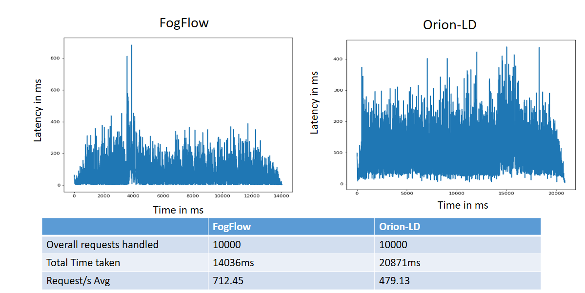
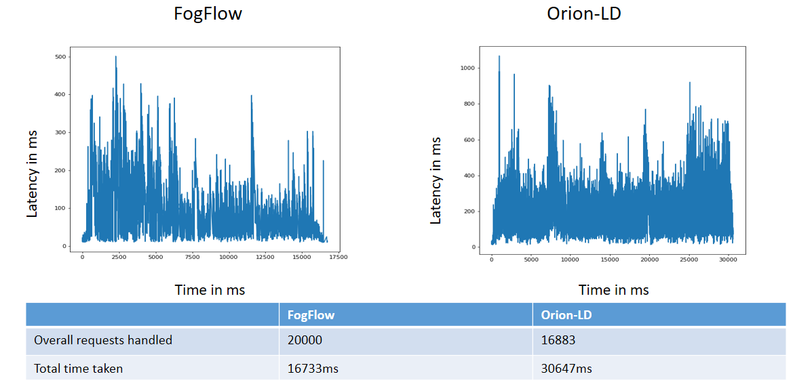
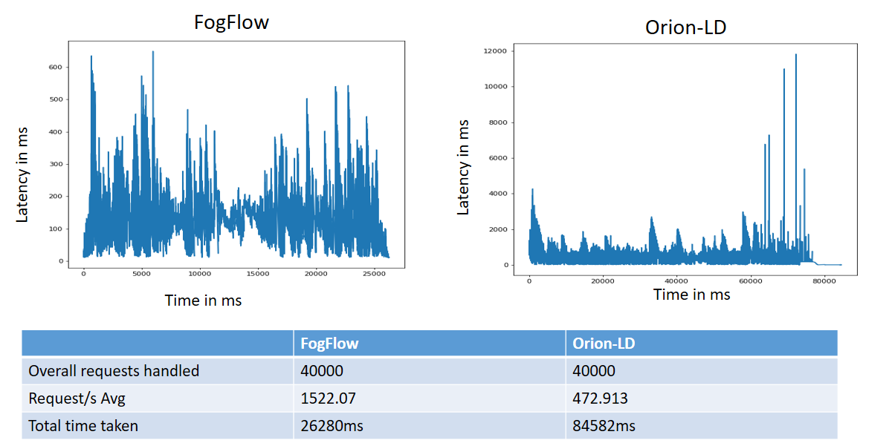
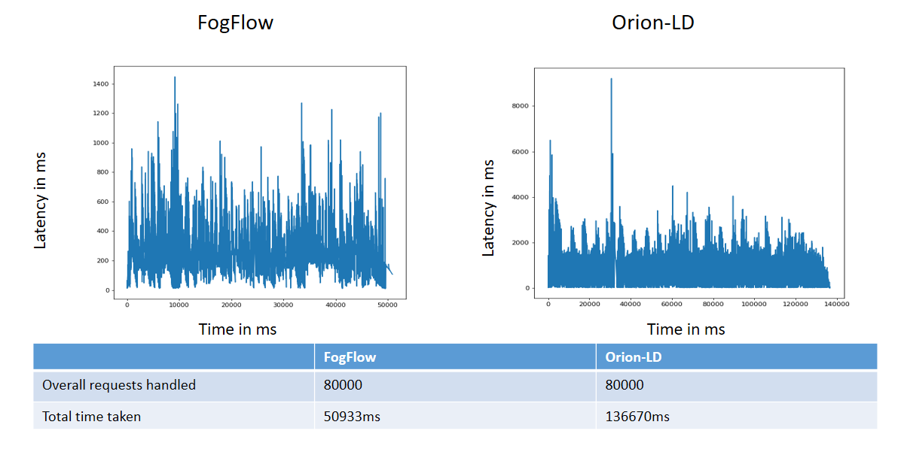
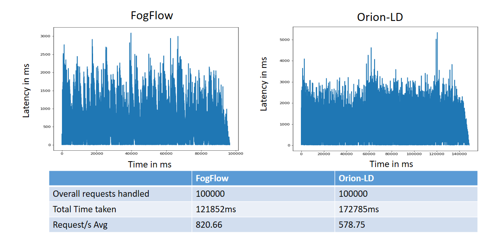

*****************************************
Performance Evaluation
*****************************************

Performance of NGSI-LD based thinBroker in FogFlow 
================================================================

This tutorial introduces the performace evaluation of NGSILD based context management systems of the FogFlow framework. Our analyses include the performance comparision of FogFlow broker with other NGSILD broker(orion broker, stelio Broker, Scorpio Broker) in terms of  throughput (number of messages per second) and response time/message propagation latency and  efficiency of context availability discoveries and context transfers in the smart city scale.Moreover, we analyze the scalability of FogFlow using multiple IoT Brokers.

Experiement Setup
------------------------------------------------

**FogFlow system:** To test the performance, I have deployed one cloud node(2vCPUs, 4 GB RAM) and two edge node(2vCPUs, 4 GB RAM) in doker container. 

**Listener client:** To measure the delay of context update from the moment sent by a context producer to the time received by a subscriber we are using listener client. Listener client is deployed on localhost(5cpu, 8GB RAM)

**Testing tool:** TO produce the test data for fogflow broker we are using Apache JMeter testing tool. JMeter is deployed on localhost(5cpu, 8GB RAM)

Throughput and latency to create new entities
--------------------------------------------------

**Entity creation** 

.. figure:: figures/v1LDCompare.png

**Performance comparision between with orion-LD:**

to test how the performance can be scaled up with more FogFlow edge nodes

Throughput and latency to query entities
--------------------------------------------------

to prepare different types of queries: by entity ID, by entity type, by the filter of entity attribute

to compare the performance with the other NGSI-LD brokers

to test how the performance can be scaled up with more FogFlow edge nodes

Update Propagation from Context Producers to Context Consumer
------------------------------------------------------------------

to measure the delay of context update from the moment sent by a context producer to the time received by a subscriber

to measure how many updates can flow from the context producer to the subscriber per second

to compare the performance with the other NGSI-LD brokers

to test how the performance can be scaled up with more subscribers

