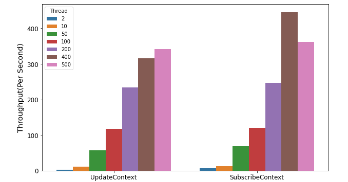
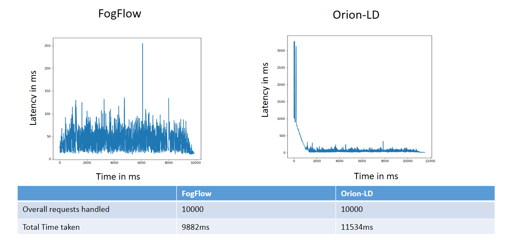
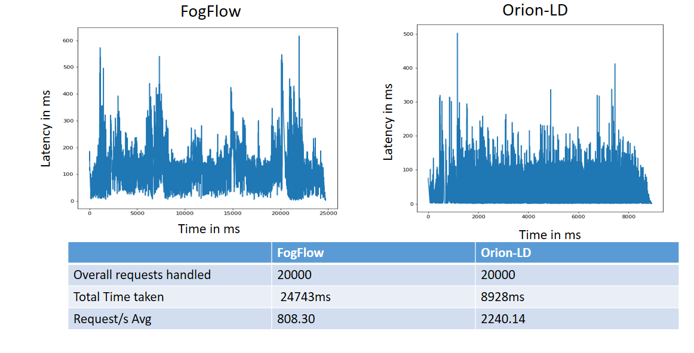
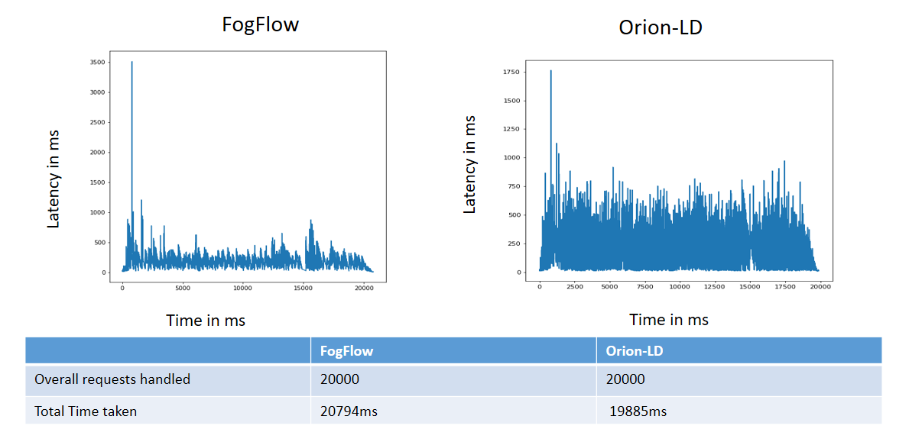
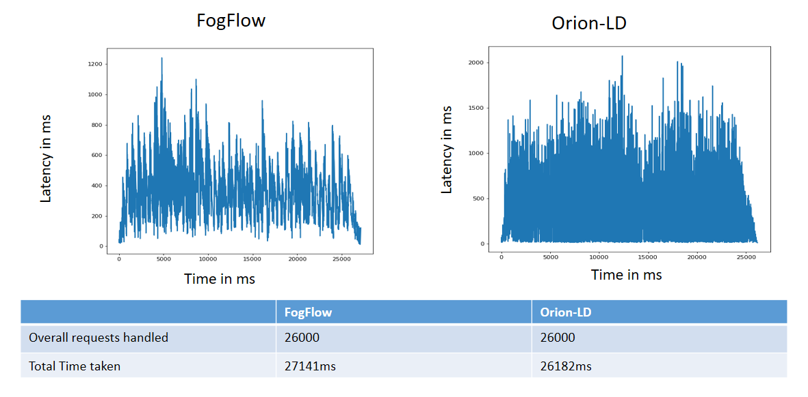
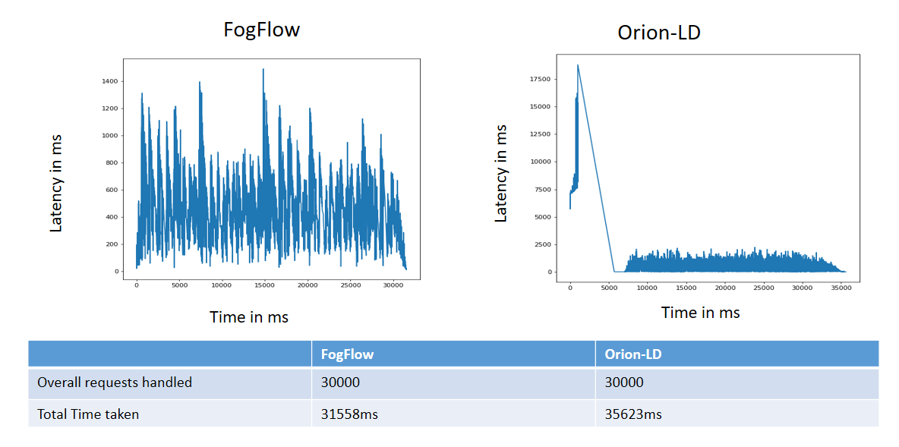

*****************************************
Performance Evaluation
*****************************************

Performance of NGSI-LD based thinBroker in FogFlow 
================================================================

This tutorial introduces the performace evaluation of NGSILD based context management systems of the FogFlow framework. Our analyses include the performance comparision of FogFlow broker with other NGSILD broker(orion broker, stelio Broker, Scorpio Broker) in terms of  throughput (number of messages per second) and response time/message propagation latency and  efficiency of context availability discoveries and context transfers in the smart city scale.Moreover, we analyze the scalability of FogFlow using multiple IoT Brokers.

Experiement Setup
------------------------------------------------

**FogFlow system:** To test the performance, I have deployed one cloud node(4 vCPUs, 8 GB RAM) and three edge node(2 vCPUs, 4 GB RAM) in doker container. 

**Listener client:** To measure the delay of context update from the moment sent by a context producer to the time received by a subscriber we are using listener client. Listener client is deployed on localhost(5 cpu, 8 GB RAM)

**Testing tool:** TO produce the test data for fogflow broker we are using Apache JMeter testing tool. JMeter is deployed on localhost(5cpu, 8GB RAM)

Throughput and latency to create new entities
--------------------------------------------------

**Throughput and latency of upsert API** 

**Performance comparision with orion-LD for upsert API:** To comparion upseert API with orion-ld we are considering various number of threads (clients) in a smart city (50, 100, 200, 400, 500 entities).  The threads may represent devices, such as sensor nodes in a smart city or applications accessing the system.  

**Senorio-1:** In the frist scenario 50 threads were utilised and every thread executed 200 requests.

.. figure:: figures/FogOrion50_200.png

The above graphs are representing **latency on y-axis and time on x-axis**. The above graphs depicts the fact that Fogflow broker is better in handling 10,000 thousand requests in an efficient manner when compared to Orion-Ld broker. With detailed anayalsis made on graphs as well as the supporting data, the fact that **Fogflow broker** handles **10,000** request in **14036 ms with low average latency** is an index which reflects the better performance of Fogflow broker over Orion-Ld Broker. **Orion-Ld broker** handles the same number of request within **greater time duration i.e. 20871 ms with higher average latency** than Fogflow.

*Hence for this scenario Fogflow broker is a better performer than Orion-LD broker.*

**Senorio-2:** In the second scenario 100 threads were utilised and every thread executed 200 requests.

.. figure:: figures/FogOrion100_200.png

**Senorio-3:** In the third sceanrio 200 threads were utilised and every thread executed 200 requests.

.. figure:: figures/FogOrion200_200.png

The above graphs are representing **latency on y-axis and time on x-axis**. The above graphs depicts the fact that Fogflow broker is better in handling 40,000 thousand requests in an efficient manner when compared to Orion-Ld broker. With detailed anayalsis made on graphs as well as the supporting data, the fact that **Fogflow broker** handles **40,000** request in **50277 ms with low average latency** is an index which reflects the better performance of Fogflow broker over Orion-Ld Broker. **Orion-Ld broker** handles the same number of request within **greater time duration i.e. 79722 ms with higher average latency** than Fogflow.

*Hence for this scenario Fogflow broker is a better performer than Orion-LD broker.*

**Senorio-4:** In the fourth scenario 400 threads were utilised and every thread executed 200 requests.

.. figure:: figures/FogOrion400_200.png

The above graphs are representing **latency on y-axis and time on x-axis**. The above graphs depicts the fact that Fogflow broker is better in handling 80,000 thousand requests in an efficient manner when compared to Orion-Ld broker. With detailed anayalsis made on graphs as well as the supporting data, the fact that **Fogflow broker** handles **80,000** request in **96543 ms with low average latency** is an index which reflects the better performance of Fogflow broker over Orion-Ld Broker. **Orion-Ld broker** handles the same number of request within **greater time duration i.e. 148627 ms with higher average latency** than Fogflow.

*Hence for this scenario Fogflow broker is a better performer than Orion-LD broker.*

**Senorio-5:** In the fifth scenario 500 threads were utilised and every thread executed 200 requests.

.. figure:: figures/FogOrion500_200.png

The above graphs are representing **latency on y-axis and time on x-axis**. The above graphs depicts the fact that Fogflow broker is better in handling 1,00,000 thousand requests in an efficient manner when compared to Orion-Ld broker. With detailed anayalsis made on graphs as well as the supporting data, the fact that **Fogflow broker** handles **1,00,000** request in **121852 ms with low average latency** is an index which reflects the better performance of Fogflow broker over Orion-Ld Broker. **Orion-Ld broker** handles the same number of request within **greater time duration i.e. 172785 ms with higher average latency** than Fogflow.

*Hence for this scenario Fogflow broker is a better performer than Orion-LD broker.*

**Performance comparision with orion-LD for upsert API:**

to test how the performance can be scaled up with more FogFlow edge nodes

Throughput and latency to query entities
--------------------------------------------------

to prepare different types of queries: by entity ID, by entity type, by the filter of entity attribute

to compare the performance with the other NGSI-LD brokers

to test how the performance can be scaled up with more FogFlow edge nodes

Update Propagation from Context Producers to Context Consumer
------------------------------------------------------------------

to measure the delay of context update from the moment sent by a context producer to the time received by a subscriber

to measure how many updates can flow from the context producer to the subscriber per second

to compare the performance with the other NGSI-LD brokers

to test how the performance can be scaled up with more subscribers
